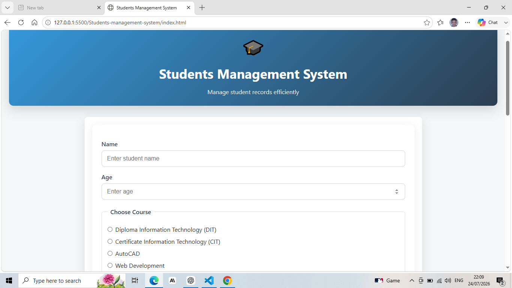
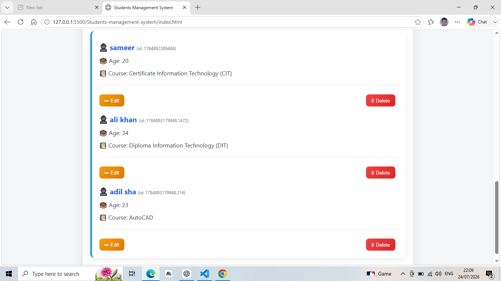
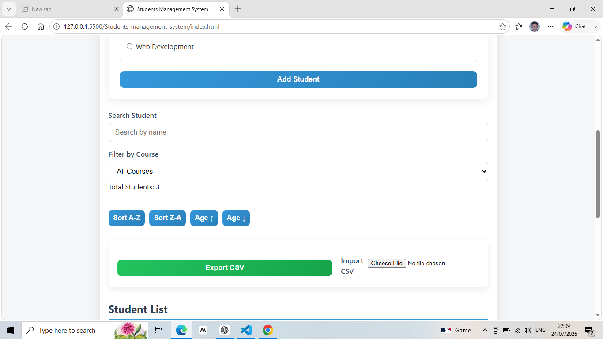

# 🎓 Student Management System

## 📖 Project Description

The Student Management System is a frontend web application built using HTML, CSS, and JavaScript. It helps users manage student records in a simple and organized way.

Users can add, edit, delete, search, filter, and sort student records. The application also supports CSV import/export and saves data in Local Storage, so records remain available even after refreshing the page.

## 📸 Screenshots

### Home Page



### Student List



### Search & Filter



## ✨ Features

- ➕ Add new students
- ✏️ Edit student details
- 🗑️ Delete students with confirmation modal
- 🔍 Search students by name or course
- 🎯 Filter students by course
- ↕️ Sort students by name (A–Z / Z–A)
- 🔢 Sort students by age (Ascending / Descending)
- 📥 Import student data from CSV
- 📤 Export student data to CSV
- 💾 Save data using Local Storage
- 🔔 Toast notifications
- 📱 Responsive design


## 🛠️ Technologies Used

- HTML5
- CSS3
- JavaScript (ES6)
- Local Storage API
- FileReader API
- Blob API

## 📂 Project Structure

```text
student-management-system/
│── index.html
│── README.md
│── script.js
│── style.css
```


## 🚀 How to Run the Project

1. Download or clone this repository.
2. Open the project folder.
3. Open the `index.html` file in your web browser.

Or, if you are using Visual Studio Code:

1. Open the project in VS Code.
2. Install the **Live Server** extension (if not already installed).
3. Right-click on `index.html`.
4. Select **Open with Live Server**.

## 🔮 Future Improvements

- Prevent duplicate records during CSV import.
- Add pagination for large student lists.
- Add student profile pictures.
- Improve form validation with custom error messages.
- Add dark mode.
- Connect the project to a backend database.

## 👨‍💻 Author

**Sameer Khan**

- Software Engineering Student
- Passionate about Web Development
-GitHub: [sameer_UOS](https://github.com/sameer_UOS)